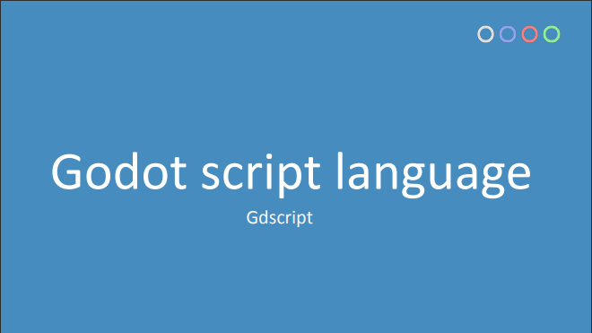
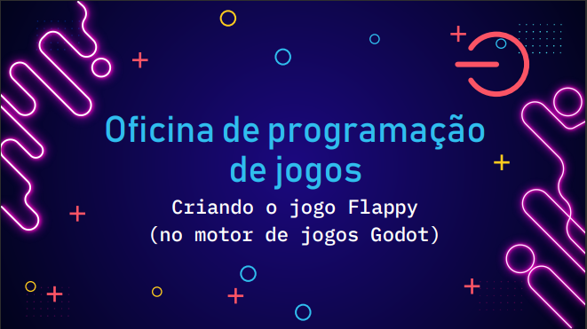

# Flappy

Yet another Flappy Bird clone - made in Godot.

Demonstration project created for the lecture "introduction to game development" presented at UFCA.

----

Projeto de demonstração apresentado para a oficina "Introdução à desenvolvimento de jogos" apresentado na UFCA.

# Apresentações

